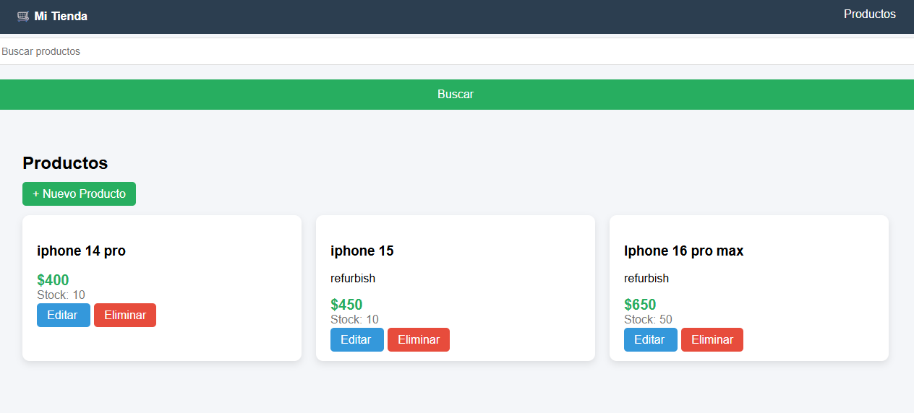
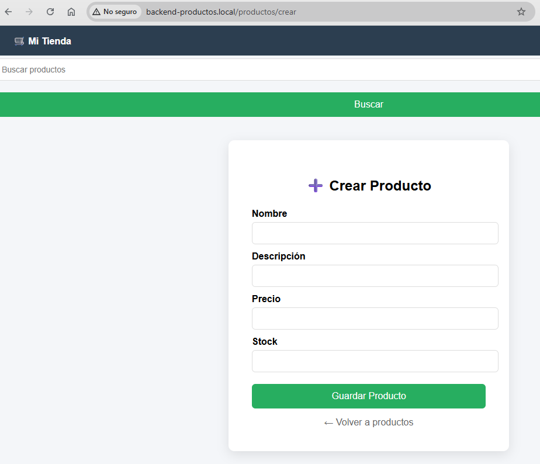
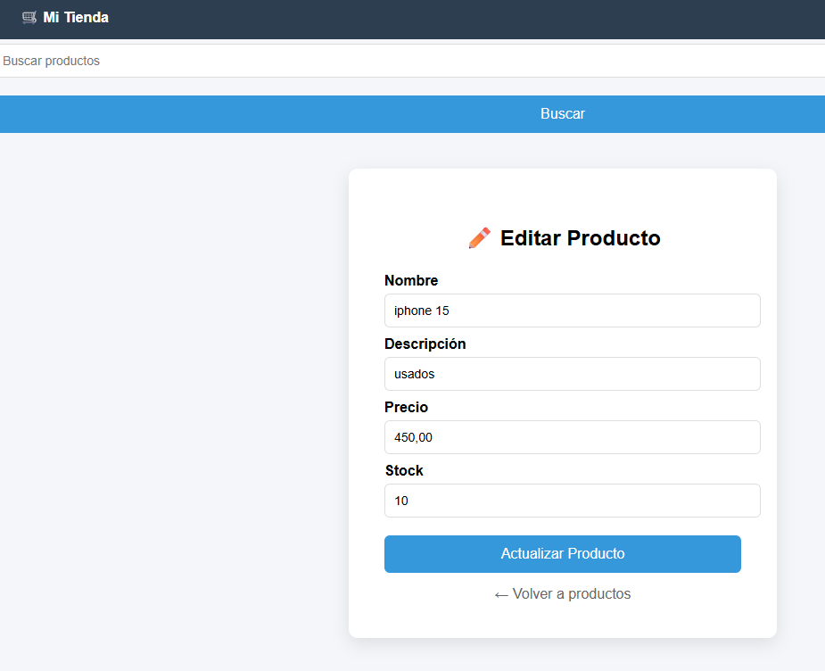
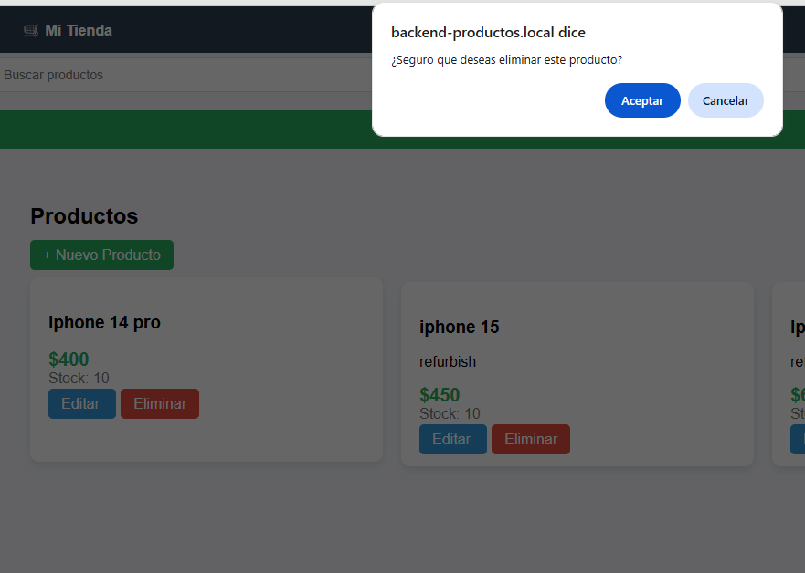
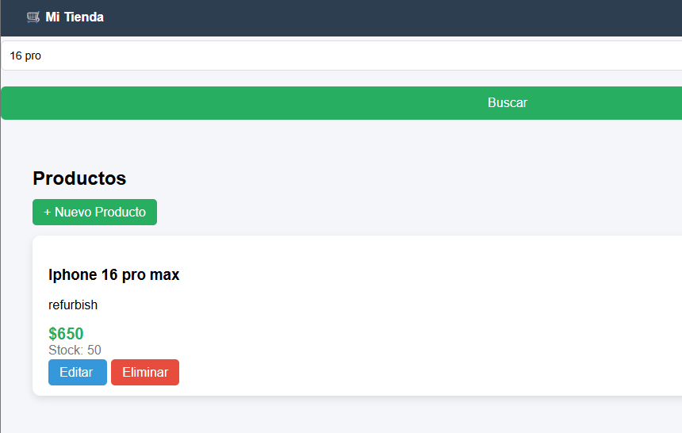
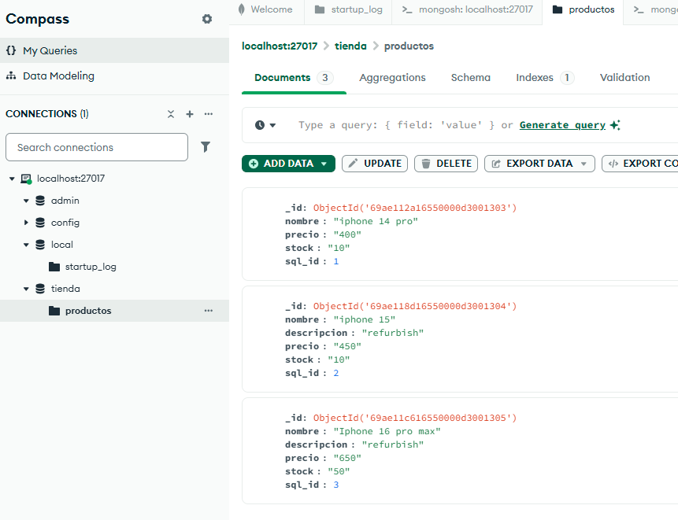
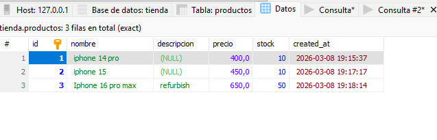

# 🛒 Sistema de Gestión de Productos - CodeIgniter 4 + SQL + MongoDB

Este proyecto es una aplicación web desarrollada con **CodeIgniter 4** que permite gestionar productos mediante un **CRUD completo** (crear, listar, editar y eliminar).

El sistema implementa una **arquitectura híbrida de almacenamiento**, utilizando:

- **MySQL (SQL)** para persistencia relacional.
- **MongoDB (NoSQL)** para almacenamiento adicional y búsquedas rápidas.

---

# 📚 Tecnologías utilizadas

- PHP 8+
- CodeIgniter 4
- MySQL
- MongoDB
- Composer
- HTML5 + CSS3

---

# 🧱 Arquitectura de CodeIgniter 4

CodeIgniter 4 utiliza el patrón de arquitectura **MVC (Model - View - Controller)**.

### 1-Controllers

Los controladores gestionan la lógica de la aplicación y reciben las solicitudes HTTP.

Ejemplo:
app/Controllers/Productos.php


Responsabilidades:

- Obtener datos del modelo
- Procesar formularios
- Enviar datos a las vistas

Ejemplo:

```php
public function index()
{
    $data['productos'] = $this->productoModel->findAll();
    return view('productos/index', $data);
}

### 2-Models

Los modelos se encargan de interactuar con las bases de datos.

Este proyecto utiliza dos modelos:

Modelo SQL
app/Models/ProductoModel.php

Este modelo usa MySQL para almacenar los productos.

Funciones principales:
insert()
update()
delete()
findAll()

Modelo NoSQL
app/Models/ProductoMongoModel.php

Este modelo se conecta a MongoDB usando la librería oficial:

mongodb/mongodb

Funciones:

insertar()
actualizar()
eliminar()
buscar()

MongoDB se utiliza principalmente para:
Búsquedas rápidas
Copia de datos para consultas

3️⃣ Views

Las vistas muestran la interfaz del sistema.

Ubicación:
app/Views/productos/

Principales vistas:

index.php     -> catálogo de productos
crear.php     -> formulario de creación
editar.php    -> formulario de edición

También se usa un layout global:

app/Views/layouts/main.php

capturas:








⚙️ Instalación del Proyecto

Esta sección explica cómo instalar y ejecutar el proyecto Proyecto-backend-CodeIgniter en un entorno local.

1. Clonar el repositorio
Primero se debe clonar el repositorio desde GitHub.
git clone https://github.com/wilsonmendezpulido/Proyecto-backend-CodeIgniter.git
Luego ingresar a la carpeta del proyecto:
cd Proyecto-backend-CodeIgniter

2. Instalar dependencias

El proyecto utiliza Composer para gestionar dependencias de PHP.
Ejecutar:
composer install

Esto instalará todas las librerías necesarias definidas en:
composer.json

Entre ellas:
CodeIgniter 4
Librerías de soporte del framework
Cliente de MongoDB

3. Configurar el archivo .env

Copiar el archivo de ejemplo:
cp env .env

Luego editar el archivo .env y configurar el entorno:
CI_ENVIRONMENT = development

4. Configurar conexión a MySQL

Dentro del archivo .env configurar la base de datos relacional:

database.default.hostname = localhost
database.default.database = tienda
database.default.username = root
database.default.password = password
database.default.DBDriver = MySQLi

5. Crear la base de datos MySQL

Crear la base de datos:
CREATE DATABASE tienda;

Crear la tabla de productos:

CREATE TABLE productos (
id INT AUTO_INCREMENT PRIMARY KEY,
nombre VARCHAR(255),
descripcion TEXT,
precio DECIMAL(10,2),
stock INT
);

6. Configurar MongoDB

El proyecto también utiliza MongoDB para almacenamiento NoSQL y búsquedas.

Agregar en el archivo .env:

mongo.uri = mongodb://localhost:27017
mongo.database = tienda

MongoDB creará automáticamente la base de datos cuando se inserte el primer documento.

Ejemplo de documento en MongoDB:

{
 "sql_id": 1,
 "nombre": "Laptop",
 "descripcion": "Lenovo",
 "precio": 2500000,
 "stock": 5
}

7. Ejecutar el servidor

CodeIgniter 4 incluye un servidor local de desarrollo.

Ejecutar:

php spark serve

El sistema quedará disponible en:

http://localhost:8080

Para acceder al módulo de productos:

http://localhost:8080/productos